<!-- Generated by GitHub Profile Agent Console. Edit profile.config.json, then run npm run generate. -->

  <picture>
    <source media="(max-width: 760px) and (prefers-color-scheme: dark)" srcset="./assets/hero/agent-console-3c920b0c-mobile-dark.svg">
    <source media="(max-width: 760px)" srcset="./assets/hero/agent-console-3c920b0c-mobile-light.svg">
    <source media="(prefers-color-scheme: dark)" srcset="./assets/hero/agent-console-3c920b0c-dark.svg">
    <source media="(prefers-color-scheme: light)" srcset="./assets/hero/agent-console-3c920b0c-light.svg">
    
  </picture>

  

  
  
  
  

| <h2>4+</h2> | <h2>98.7%</h2> | <h2>100M+</h2> | <h2>3.9</h2> |
| :---: | :---: | :---: | :---: |
| Years building production ML | Recall@5, agentic KG-RAG | Records/day through PySpark ETL | GPA, M.S. Data Science (TAMU) |

## About Me

I'm a Machine Learning and AI Engineer with four years of experience shipping production ML across telecom, finance, healthcare, and agricultural research. At Texas A&M's AISLS Lab I build agentic RAG systems over knowledge graphs and fine-tune open LLMs on local GPU infrastructure.

Before that, at Tata Consultancy Services, I engineered PySpark pipelines, NLP classifiers, and multimodal QC models on Docker and Kubernetes. I don't call a model done until it has a held-out eval set, a baseline to beat, and a recommendation people can act on.

## Current Focus

| Area | What I am exploring |
| --- | --- |
| **Agentic RAG** | Query routing over fine-tuned knowledge-graph retrievers, hybrid BM25 + FAISS search, and source-level citations. |
| **LLM Fine-tuning** | LoRA / QLoRA / PEFT on Gemma and LLaMA for domain corpora, trained on local GPU clusters. |
| **Multimodal Models** | Vision-language models for medical imaging and CLIP-style contrastive learning. |
| **Production ML** | PySpark ETL at 100M+ records/day, drift monitoring, and Docker + Kubernetes deployment. |

## Featured Work

| Project | Focus | Why it matters |
| --- | --- | --- |
| [**KG Agentic RAG**](https://kiranbabuathina.com/#projects) | Agentic retrieval over knowledge graphs | Query-routing layer over 3 fine-tuned knowledge-graph retrievers on TAMU HPC (2x RTX 6000). **98.7% Recall@5** on a held-out eval set. |
| [**Azure RAG Platform**](https://kiranbabuathina.com/#projects) | Source-grounded RAG on Azure | FastAPI + React chat over 120,000+ chunks with hybrid BM25 + FAISS and top-5 source traceability. **95% Hit@5, 0.925 MRR** on 1,000 expert questions. |
| [**Retinal VLM**](https://kiranbabuathina.com/#projects) | Vision-language models for healthcare | Fine-tuned MedGemma 4B on paired fundus images and clinical notes, validated on 1,200+ expert-annotated images. **91% accuracy across 12 diseases.** |
| [**Exoplanet ML**](https://github.com/FriendyKiran/Exoplanet-Discovery-using-Machine-Learning) | NASA Space Apps 2025 | Ensemble of RF, XGBoost, LightGBM, Gradient Boosting, and MLP classifying Kepler + TESS objects, served as a Streamlit app. **96.64% accuracy.** |
| [**CLIP Contrastive**](https://kiranbabuathina.com/#projects) | Multimodal contrastive learning | Dual-encoder ResNet-50 + DistilBERT trained with NT-Xent and iSogCLR losses. **+17% image-text retrieval on MSCOCO, +14% zero-shot on ImageNet** vs. baseline CLIP. |
| [**Livestock Twin**](https://kiranbabuathina.com/#projects) | Sensor-driven digital twin | Agent-based simulation (Mesa) fed by live MQTT sensor streams, tracking per-animal energy by the minute and forecasting monthly methane. |

## Research Direction

I'm interested in retrieval systems that can route questions to the right knowledge source, cite their evidence, and be measured against a held-out eval set, plus fine-tuning open models so domain queries never need a general-purpose cloud API.

## Tech Stack

  

`Python` · `SQL` · `PyTorch` · `Hugging Face` · `LangChain` · `LangGraph` · `FAISS` · `Scikit-learn` · `XGBoost` · `FastAPI` · `React` · `PySpark` · `Azure OpenAI` · `Azure ML` · `AWS SageMaker` · `Docker` · `Kubernetes` · `PostgreSQL`

## Publications

- **2025** · [An agent-based framework of cattle value discovery system for precision nutrient requirements and utilization prediction of beef cattle](https://www.cabidigitallibrary.org/doi/full/10.5555/20250456444) K. Kaniyamattam, V. Kulangara-Veettil, P. Kundu, **K. B. Athina**, L. O. Tedeschi _CABI Digital Library · Vol. 16, Issue 3_

## Recent Activity

<!-- AUTO:ACTIVITY:START -->
_No recent public activity was found._
<!-- AUTO:ACTIVITY:END -->

## Contribution Snake

  <picture>
    <source media="(prefers-color-scheme: dark)" srcset="https://raw.githubusercontent.com/FriendyKiran/FriendyKiran/output/github-contribution-grid-snake-dark.svg">
    <source media="(prefers-color-scheme: light)" srcset="https://raw.githubusercontent.com/FriendyKiran/FriendyKiran/output/github-contribution-grid-snake.svg">
    
  </picture>

---

  Every model ships with an eval set and a baseline to beat.

