<!-- Generated from profile.json by scripts/build.mjs. Edit the JSON, not this file. -->
<div align="center">

<picture>
  <source media="(prefers-color-scheme: dark)" srcset="./assets/hero-dark.svg">
  <source media="(prefers-color-scheme: light)" srcset="./assets/hero-light.svg">
  
</picture>

<a href="https://kiranbabuathina.com"></a> <a href="https://www.linkedin.com/in/athinakiranbabu"></a> <a href="https://scholar.google.com/citations?user=wWen3jgAAAAJ&hl=en"></a> <a href="mailto:kiranathina8@gmail.com"></a>

</div>

### `$ cat model_card.yaml`

```yaml
model_id: FriendyKiran/kiran-babu-athina
pipeline_tag: machine-learning-engineering
base_model: B.Tech ECE (GVP, 2021)
fine_tuned_on:
  - telecom
  - finance
  - healthcare
  - agricultural research
training:
  industry: Tata Consultancy Services, 2021–2023
  graduate: M.S. Data Science, Texas A&M (3.9 GPA)
  current: Research Assistant, Texas A&M AISLS Lab
intended_use:
  - agentic RAG systems
  - LLM fine-tuning (LoRA / QLoRA / PEFT)
  - multimodal + vision-language models
  - production ML pipelines
eval_policy: no model ships without a held-out eval set and a baseline to beat
limitations: will ask for your eval set before your roadmap
license: open to opportunities
```

### `$ trace --request` &nbsp;·&nbsp; how I build retrieval systems

<picture>
  <source media="(prefers-color-scheme: dark)" srcset="./assets/pipeline-dark.svg">
  <source media="(prefers-color-scheme: light)" srcset="./assets/pipeline-light.svg">
  
</picture>

### `$ ls ./models` &nbsp;·&nbsp; selected work

<table>
<tr>
<td width="50%"><a href="https://kiranbabuathina.com/#projects"><picture>
  <source media="(prefers-color-scheme: dark)" srcset="./assets/cards/kg-rag-dark.svg">
  <source media="(prefers-color-scheme: light)" srcset="./assets/cards/kg-rag-light.svg">
  
</picture></a></td>
<td width="50%"><a href="https://kiranbabuathina.com/#projects"><picture>
  <source media="(prefers-color-scheme: dark)" srcset="./assets/cards/azure-rag-dark.svg">
  <source media="(prefers-color-scheme: light)" srcset="./assets/cards/azure-rag-light.svg">
  
</picture></a></td>
</tr>
<tr>
<td width="50%"><a href="https://kiranbabuathina.com/#projects"><picture>
  <source media="(prefers-color-scheme: dark)" srcset="./assets/cards/retinal-vlm-dark.svg">
  <source media="(prefers-color-scheme: light)" srcset="./assets/cards/retinal-vlm-light.svg">
  
</picture></a></td>
<td width="50%"><a href="https://github.com/FriendyKiran/Exoplanet-Discovery-using-Machine-Learning"><picture>
  <source media="(prefers-color-scheme: dark)" srcset="./assets/cards/exoplanet-dark.svg">
  <source media="(prefers-color-scheme: light)" srcset="./assets/cards/exoplanet-light.svg">
  
</picture></a></td>
</tr>
<tr>
<td width="50%"><a href="https://kiranbabuathina.com/#projects"><picture>
  <source media="(prefers-color-scheme: dark)" srcset="./assets/cards/clip-dark.svg">
  <source media="(prefers-color-scheme: light)" srcset="./assets/cards/clip-light.svg">
  
</picture></a></td>
<td width="50%"><a href="https://kiranbabuathina.com/#projects"><picture>
  <source media="(prefers-color-scheme: dark)" srcset="./assets/cards/livestock-twin-dark.svg">
  <source media="(prefers-color-scheme: light)" srcset="./assets/cards/livestock-twin-light.svg">
  
</picture></a></td>
</tr>
</table>

<sub>Cards link to the code where it's public, otherwise to the case study on my <a href="https://kiranbabuathina.com/#projects">portfolio</a>.</sub>

### `>>> kiran.fit()` &nbsp;·&nbsp; training log

<picture>
  <source media="(prefers-color-scheme: dark)" srcset="./assets/career-dark.svg">
  <source media="(prefers-color-scheme: light)" srcset="./assets/career-light.svg">
  
</picture>

<details>
<summary><b><code>$ cat requirements.txt</code></b> &nbsp;·&nbsp; tech stack</summary>

```python
# languages
python  sql  javascript  r

# llm + rag
transformers  peft  langchain  langgraph  faiss-cpu  rank-bm25

# modeling
torch  tensorflow  scikit-learn  xgboost  lightgbm

# serving + apps
fastapi  streamlit  react

# data + infra
pyspark  hadoop  postgresql  mongodb  redis  docker  kubernetes

# cloud
azure-openai  azure-ai-search  azure-ml  aws-sagemaker  aws-ec2
```

</details>

<details>
<summary><b><code>$ cat publications.bib</code></b> &nbsp;·&nbsp; research output</summary>

- **2025** · [An agent-based framework of cattle value discovery system for precision nutrient requirements and utilization prediction of beef cattle](https://www.cabidigitallibrary.org/doi/full/10.5555/20250456444)  
  <sub>K. Kaniyamattam, V. Kulangara-Veettil, P. Kundu, **K. B. Athina**, L. O. Tedeschi · _CABI Digital Library · Vol. 16, Issue 3, p. 449_</sub>

**Certifications:** NVIDIA DLI Certified · Generative AI Fundamentals · PCAP: Python · CCNA: Introduction to Networks

</details>

### `$ watch gh-smi` &nbsp;·&nbsp; live telemetry

<picture>
  <source media="(prefers-color-scheme: dark)" srcset="./assets/smi-dark.svg">
  <source media="(prefers-color-scheme: light)" srcset="./assets/smi-light.svg">
  
</picture>

<sub>Regenerated daily by a GitHub Action from the GitHub GraphQL API — no third-party stat cards.</sub>

<div align="center">

<br>

**open to ML Engineer · AI Engineer · Data Scientist roles** → [kiranathina8@gmail.com](mailto:kiranathina8@gmail.com)

<sub><code>early_stopping=False</code></sub>

</div>
